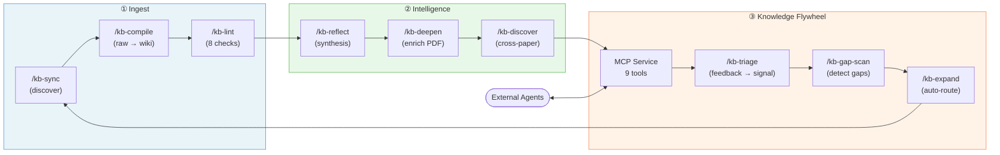

# NORIA

**Networked Origin-traced Research Iteration for Agents** — named after the [noria](https://en.wikipedia.org/wiki/Noria), a self-driven water wheel that lifts water from rivers to aqueducts. NORIA lifts scattered literature into structured, traceable knowledge that agents can consume.

An agent-first academic research knowledge service with a self-reinforcing knowledge flywheel for CS/AI researchers.

## Key Features

- **5-level provenance model** — every claim carries trust level (`user-verified` > `source-derived` > `llm-derived` > `social-lead` > `query-derived`). Synthesis requires ≥2 source-derived citations.
- **Knowledge flywheel** — feedback → gap detection → source expansion → better retrieval → feedback. Closed-loop via signal-index + demand prior reranking.
- **Section-level citations** — `[source: citekey, sec.3.2]`, not just paper-level references. Venue claims verified against S2/DBLP/OpenReview.
- **23 slash commands** — full CLI workflow from `/kb-sync` (discovery) to `/kb-reflect` (synthesis) to `/kb-expand` (flywheel automation).
- **30 TypeScript/Python tools** — progressive PDF reader, multi-platform search (arXiv, S2, GitHub, Twitter, WeChat), graph analysis, community detection.
- **MCP Knowledge Service** — remote agents query the wiki via `search`, `ask`, `gap_scan`, `list_concepts`, `graph_neighbors`, `submit_feedback`.
- **Multi-model routing** — Opus (synthesis), Sonnet (compile), Haiku (lint), GPT-5.4 (adversarial review).
- **Obsidian frontend** — Juggl graph visualization (4-layer node coloring), Dataview dashboards, MOC pages, Canvas maps.

## Architecture

```
Raw Sources (user owns)  →  LLM Engine (Claude Code)  →  Wiki (LLM maintains)
   Zotero / arXiv / S2        23 skills + 30 tools         sources / concepts /
   Twitter / WeChat / GitHub   multi-model routing          synthesis / entities
                                                         →  MCP Service (remote agents)
```

### Workflow



| Phase | Commands | What happens |
|-------|----------|-------------|
| **① Ingest** | `/kb-sync` → `/kb-compile` → `/kb-lint` | Papers discovered, compiled to wiki, quality-gated |
| **② Intelligence** | `/kb-reflect` → `/kb-deepen` → `/kb-discover` | Synthesis written, PDFs enriched, cross-paper insights found |
| **③ Flywheel** | MCP → `/kb-triage` → `/kb-gap-scan` → `/kb-expand` | Feedback drives gap detection, gaps auto-route back to ① |

See [ARCHITECTURE.md](ARCHITECTURE.md) for the full system design, directory structure, provenance model, and tool inventory.

## Quick Start

### Prerequisites

- [Claude Code](https://claude.ai/claude-code) CLI
- Node.js 20+ with `npx tsx`
- Python 3.10+ (for Zotero sync, MCP server)
- [Obsidian](https://obsidian.md) (optional, for visualization)

### Setup

```bash
git clone git@github.com:fzhiy/noria.git
cd noria

# Start working with Claude Code
claude

# Show project overview
/wiki-help

# Sync latest papers from Semantic Scholar
/kb-sync s2 "web agent reinforcement learning" --limit 10

# Compile new sources into wiki
/kb-compile

# Check wiki health
/kb-lint

# Ask a research question
/kb-ask "How does WebRL handle curriculum generation?"

# Detect knowledge gaps
/kb-gap-scan

# Write cross-cutting synthesis
/kb-reflect
```

### MCP Knowledge Service

```bash
# Start the MCP server
python3 tools/noria-mcp-server.py 3849

# From another project, configure in .mcp.json:
# { "noria": { "url": "http://localhost:3849" } }
```

## Wiki Structure

| Directory | Content | Count |
|-----------|---------|-------|
| `wiki/sources/` | Paper summaries with bibliographic metadata | — (starts empty) |
| `wiki/concepts/` | Topic articles with wikilinks | — (starts empty) |
| `wiki/synthesis/` | Cross-cutting thematic analyses | — (starts empty) |
| `wiki/entities/` | Lab/researcher profiles | — (starts empty) |
| `raw/` | User-owned source inputs (never modified by LLM) | — |
| `outputs/` | Generated artifacts (never fed back into wiki) | — |

## Slash Commands

| Phase | Commands |
|-------|----------|
| **Ingest & Compile** | `/kb-sync`, `/kb-ingest`, `/kb-import`, `/kb-compile`, `/kb-lint` |
| **Intelligence** | `/kb-ask`, `/kb-reflect`, `/kb-deepen`, `/kb-discover`, `/kb-deep-research`, `/research-lit` |
| **Flywheel** | `/kb-triage`, `/kb-gap-scan`, `/kb-expand`, `/kb-trending` |
| **Maintenance** | `/kb-merge`, `/kb-output`, `/meta-optimize` |
| **Review** | `/research-review`, `/gpt-nightmare-review` |
| **Utility** | `/wiki-help`, `/agent-team-plan`, `/mermaid-diagram` |

## Design Principles

1. **Provenance-first** — every claim traceable to source with trust level
2. **Token-efficient** — progressive reading (5 modes), manifest-gated compile, RT pre-screening
3. **Human-gated** — auto-discovery but human-approved expansion
4. **Lint before reflect** — deterministic quality gate before LLM synthesis
5. **Multi-model routing** — cheapest sufficient model for each task
6. **Dual-track isolation** — social media (`social-lead`) quarantined from academic synthesis

## Documentation

- [ARCHITECTURE.md](ARCHITECTURE.md) — full system design, tools inventory, directory structure
- [schema.md](schema.md) — wiki page format, provenance rules, frontmatter specification
- [docs/tooling-reference.md](docs/tooling-reference.md) — tool usage details
- [docs/juggl-visual-guide.md](docs/juggl-visual-guide.md) — Obsidian graph visualization guide
- [docs/remote-wiki-access.md](docs/remote-wiki-access.md) — MCP remote service setup

## Acknowledgments

NORIA builds on the shoulders of these projects and services:

- **[Karpathy llm-wiki](https://gist.github.com/karpathy/442a6bf555914893e9891c11519de94f)** — the original LLM Wiki pattern that inspired this project's core architecture
- **[Claude Code](https://claude.ai/claude-code)** (Anthropic) — the AI agent runtime that powers NORIA's multi-model orchestration
- **[Semantic Scholar API](https://api.semanticscholar.org/)** (Allen AI) — academic paper search, citation data, and venue metadata
- **[DeepXiv](https://deepxiv.org/)** — cloud API for progressive arXiv paper reading (zero LLM cost)
- **[Obsidian](https://obsidian.md/)** — the knowledge visualization frontend, with plugins: [Juggl](https://juggl.io/), [Dataview](https://github.com/blacksmithgu/obsidian-dataview), [Supercharged Links](https://github.com/mdelobelle/metadatamenu)
- **[QMD](https://github.com/nicholasgasior/qmd)** — local BM25 + vector search engine for wiki content
- **[Scweet](https://github.com/Altimis/Scweet)** — Twitter/X data collection (users must comply with X/Twitter ToS)
- **[Hermes-Agent](https://github.com/NousResearch/Hermes-Function-Calling)** (NousResearch) — inspiration for the feedback loop design pattern
- **[OpenAI Codex CLI](https://github.com/openai/codex)** — cross-model adversarial review via GPT-5.4
- **[Auto-claude-code-research-in-sleep](https://github.com/wanshuiyin/Auto-claude-code-research-in-sleep)** — inspiration for autonomous research loop design
- **[llm-knowledge-base](https://github.com/louiswang524/llm-knowledge-base)** — reference implementation for LLM-powered knowledge base architecture


## Contributing

See [CONTRIBUTING.md](CONTRIBUTING.md) for guidelines.

## License

[MIT](LICENSE)
