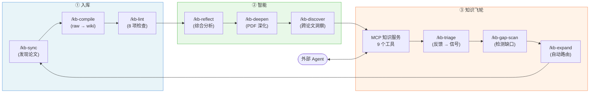

# NORIA

**Networked Origin-traced Research Iteration for Agents** — 得名于 [Noria](https://zh.wikipedia.org/wiki/%E8%AF%BA%E9%87%8C%E4%BA%9A%E6%B0%B4%E8%BD%AE)（诺里亚水轮），一种自驱动的水轮，将河水提升至高处渠道。NORIA 将分散的文献提升为结构化、可追溯、可被 agent 消费的精炼知识。

面向 CS/AI 研究者的 Agent-first 学术研究知识服务，内置自增强的知识飞轮。

## 核心特性

- **5 级来源追溯模型** — 每条声明携带信任级别（`user-verified` > `source-derived` > `llm-derived` > `social-lead` > `query-derived`）。综合分析需要 ≥2 条 source-derived 引用。
- **知识飞轮** — 反馈 → 缺口检测 → 来源扩展 → 更好的检索 → 反馈。通过 signal-index + demand prior 重排实现闭环。
- **章节级引用** — `[source: citekey, sec.3.2]`，不只是论文级引用。会议级别通过 S2/DBLP/OpenReview 验证。
- **23 个 Slash 命令** — 从 `/kb-sync`（发现）到 `/kb-reflect`（综合）到 `/kb-expand`（飞轮自动化）的完整 CLI 工作流。
- **30 个 TypeScript/Python 工具** — 渐进式 PDF 读取器、多平台搜索（arXiv、S2、GitHub、Twitter、微信公众号）、图谱分析、社区检测。
- **MCP 知识服务** — 远程 agent 通过 `search`、`ask`、`gap_scan`、`list_concepts`、`graph_neighbors`、`submit_feedback` 查询 wiki。
- **多模型路由** — Opus（综合）、Sonnet（编译）、Haiku（检查）、GPT-5.4（对抗性审查）。
- **Obsidian 前端** — Juggl 图谱可视化（4 层节点着色）、Dataview 仪表盘、MOC 页面、Canvas 地图。

## 架构

```
原始来源（用户拥有）  →  LLM 引擎（Claude Code）  →  Wiki（LLM 维护）
   Zotero / arXiv / S2        23 技能 + 30 工具         sources / concepts /
   Twitter / 微信 / GitHub     多模型路由               synthesis / entities
                                                       →  MCP 服务（远程 agent）
```

### 工作流



| 阶段 | 命令 | 说明 |
|------|------|------|
| **① 入库** | `/kb-sync` → `/kb-compile` → `/kb-lint` | 发现论文、编译到 wiki、质量门控 |
| **② 智能** | `/kb-reflect` → `/kb-deepen` → `/kb-discover` | 撰写综合、PDF 深化、跨论文洞察 |
| **③ 飞轮** | MCP → `/kb-triage` → `/kb-gap-scan` → `/kb-expand` | 反馈驱动缺口检测，缺口自动路由回 ① |

完整系统设计参见 [ARCHITECTURE.md](ARCHITECTURE.md)。

## 快速开始

### 前置要求

- [Claude Code](https://claude.ai/claude-code) CLI
- Node.js 20+（含 `npx tsx`）
- Python 3.10+（用于 Zotero 同步、MCP 服务器）
- [Obsidian](https://obsidian.md)（可选，用于可视化）

### 使用

```bash
git clone git@github.com:fzhiy/noria.git
cd noria

# 启动 Claude Code
claude

# 查看项目概览
/wiki-help

# 从 Semantic Scholar 同步最新论文
/kb-sync s2 "web agent reinforcement learning" --limit 10

# 编译新来源到 wiki
/kb-compile

# 检查 wiki 健康状态
/kb-lint

# 提问研究问题
/kb-ask "WebRL 如何处理课程生成？"

# 检测知识缺口
/kb-gap-scan

# 撰写跨论文综合分析
/kb-reflect
```

### MCP 知识服务

```bash
# 启动 MCP 服务器
python3 tools/noria-mcp-server.py 3849

# 在其他项目中配置 .mcp.json：
# { "noria": { "url": "http://localhost:3849" } }
```

## Wiki 结构

| 目录 | 内容 | 数量 |
|------|------|------|
| `wiki/sources/` | 论文摘要 + 完整书目元数据 | — (初始为空) |
| `wiki/concepts/` | 主题文章 + wikilinks | — (初始为空) |
| `wiki/synthesis/` | 跨论文主题分析 | — (初始为空) |
| `wiki/entities/` | 实验室/研究者档案 | — (初始为空) |
| `raw/` | 用户拥有的原始输入（LLM 不修改） | — |
| `outputs/` | 生成的产物（不回流到 wiki） | — |

## Slash 命令

| 阶段 | 命令 |
|------|------|
| **入库 & 编译** | `/kb-sync`, `/kb-ingest`, `/kb-import`, `/kb-compile`, `/kb-lint` |
| **智能分析** | `/kb-ask`, `/kb-reflect`, `/kb-deepen`, `/kb-discover`, `/kb-deep-research`, `/research-lit` |
| **飞轮循环** | `/kb-triage`, `/kb-gap-scan`, `/kb-expand`, `/kb-trending` |
| **维护** | `/kb-merge`, `/kb-output`, `/meta-optimize` |
| **审查** | `/research-review`, `/gpt-nightmare-review` |
| **工具** | `/wiki-help`, `/agent-team-plan`, `/mermaid-diagram` |

## 设计原则

1. **来源追溯优先** — 每条声明可追溯到来源，带信任级别
2. **Token 高效** — 渐进式读取（5 种模式）、manifest 门控编译、RT 预筛选
3. **人工把关** — 自动发现但人工审批扩展
4. **检查先于综合** — 确定性质量门控先于 LLM 综合（lint-gate hook 强制执行）
5. **多模型路由** — 每项任务使用最经济的足够模型
6. **双轨隔离** — 社交媒体（`social-lead`）与学术综合隔离

## 文档

- [ARCHITECTURE.md](ARCHITECTURE.md) — 完整系统设计、工具清单、目录结构
- [schema.md](schema.md) — Wiki 页面格式、来源追溯规则、frontmatter 规范
- [docs/tooling-reference.md](docs/tooling-reference.md) — 工具使用详情
- [docs/juggl-visual-guide.md](docs/juggl-visual-guide.md) — Obsidian 图谱可视化指南
- [docs/remote-wiki-access.md](docs/remote-wiki-access.md) — MCP 远程服务配置

## 致谢

NORIA 构建于以下项目和服务之上：

- **[Karpathy llm-wiki](https://gist.github.com/karpathy/442a6bf555914893e9891c11519de94f)** — 启发本项目核心架构的 LLM Wiki 模式
- **[Claude Code](https://claude.ai/claude-code)** (Anthropic) — 驱动 NORIA 多模型编排的 AI agent 运行时
- **[Semantic Scholar API](https://api.semanticscholar.org/)** (Allen AI) — 学术论文搜索、引用数据、会议元数据
- **[DeepXiv](https://github.com/DeepXiv/deepxiv_sdk)** — arXiv 论文渐进式云端读取 API（零 LLM 成本）
- **[Obsidian](https://obsidian.md/)** — 知识可视化前端，插件：[Juggl](https://juggl.io/)、[Dataview](https://github.com/blacksmithgu/obsidian-dataview)、[Supercharged Links](https://github.com/mdelobelle/metadatamenu)
- **[QMD](https://github.com/nicholasgasior/qmd)** — 本地 BM25 + 向量搜索引擎
- **[Scweet](https://github.com/Altimis/Scweet)** — Twitter/X 数据采集（用户需自行遵守 X/Twitter 服务条款）
- **[Hermes-Agent](https://github.com/NousResearch/hermes-agent)** (NousResearch) — 反馈闭环设计模式的灵感来源
- **[OpenAI Codex CLI](https://github.com/openai/codex)** — 通过 GPT-5.4 进行跨模型对抗性审查
- **[Auto-claude-code-research-in-sleep](https://github.com/wanshuiyin/Auto-claude-code-research-in-sleep)** — 自主研究循环设计的灵感来源
- **[llm-knowledge-base](https://github.com/louiswang524/llm-knowledge-base)** — LLM 知识库架构参考实现


## 贡献

参见 [CONTRIBUTING.md](CONTRIBUTING.md)。

## 许可证

[MIT](LICENSE)
